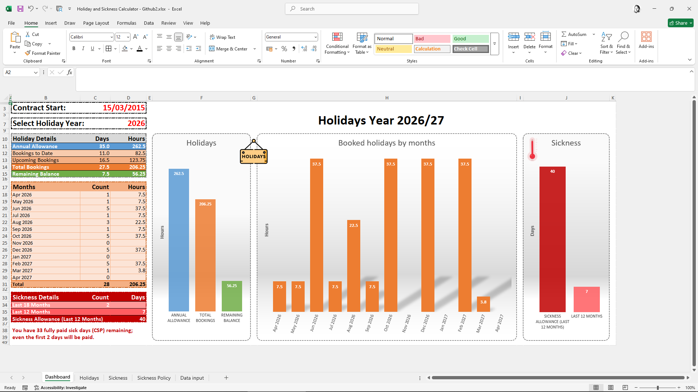
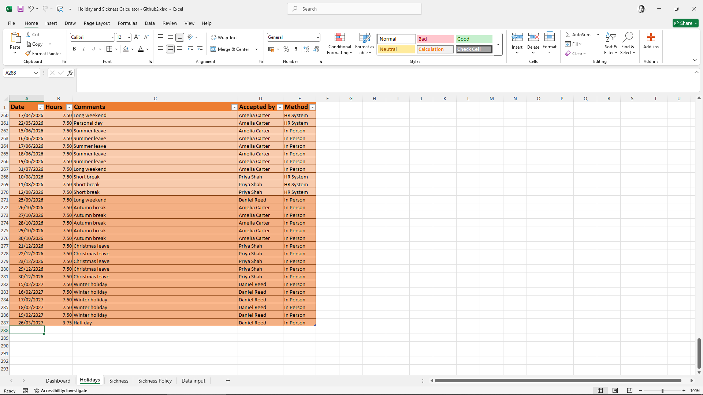
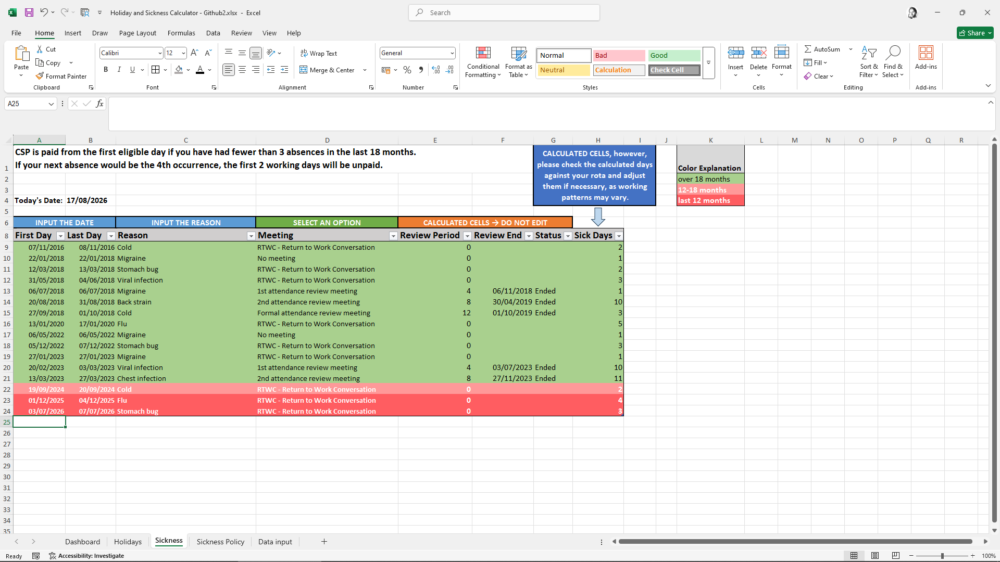
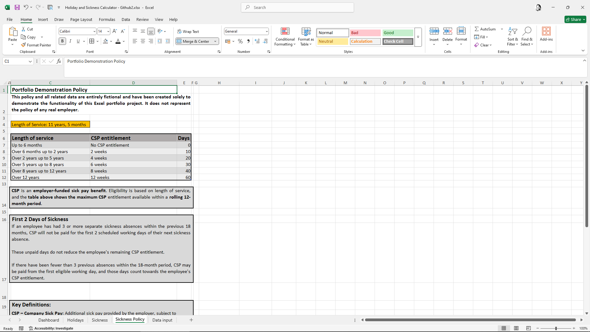

# Excel Holiday & Sickness Calculator

An interactive Microsoft Excel project for tracking holiday entitlement, holiday bookings, sickness absence and Company Sick Pay (CSP), with automated business-rule calculations and dashboard reporting.

The project was built to demonstrate practical **Excel**, **data analysis**, **business-rule modelling**, **data validation**, **conditional formatting** and **dashboard design** skills in a realistic workplace-style scenario.

> **Portfolio disclaimer:** All employee data and all policy rules in this workbook are entirely fictional and were created solely for demonstration purposes. The project does not represent the employees, data or policies of any real organisation.

## Key Features

- Holiday allowance and remaining-balance calculations
- Holiday bookings to date and upcoming bookings
- Monthly holiday summaries and charts
- Sickness absence tracking
- Working-day calculations using `NETWORKDAYS`
- Manual adjustment of calculated sickness days where individual rota patterns differ
- Company Sick Pay (CSP) entitlement based on length of service
- Rolling 12-month and 18-month sickness calculations
- Attendance-review periods and automatic review-end dates
- Automatic `In Process` / `Ended` review status
- Data Validation for controlled user input
- Reference and lookup tables separated from operational data
- Date-driven Conditional Formatting
- Dashboard-style visual reporting

## Holiday Tracking

The **Holidays** worksheet stores individual holiday entries, including full days, half days and shorter periods such as early finishes.

Recorded fields include:

- Date
- Hours
- Comments / booking description
- Accepted by
- Booking method

The data is stored in an Excel Table, allowing formulas, reporting and formatting to work consistently as new records are added.

### Dynamic Conditional Formatting

Holiday rows use **date-driven Conditional Formatting**. Bookings that fall in the future relative to the current date automatically change appearance, making upcoming leave immediately distinguishable from historical bookings.

Because the formatting is based on the date rather than manually applied colours, it updates automatically as time passes.

## Sickness Tracking

The **Sickness** worksheet records periods of sickness absence and applies automated policy-based calculations.

It includes:

- First Day
- Last Day
- Reason
- Attendance meeting / review stage
- Review Period
- Review End
- Review Status
- Sick Days

`NETWORKDAYS` is used to estimate working days between the first and last day of an absence. Because employees may have different rota patterns, the workbook clearly tells the user to check the automatically calculated value against their own rota and adjust it when necessary.

### Date-Driven Conditional Formatting

Sickness rows are automatically colour-coded according to how recently the absence occurred:

- **Over 18 months**
- **12–18 months**
- **Last 12 months**

This makes records that fall within relevant rolling policy periods easy to identify visually. The colours change automatically relative to the current date.

## Fictional Sickness Policy

The workbook contains a completely fictional sickness and attendance policy created specifically for this portfolio project.

The policy model demonstrates how written business rules can be converted into structured Excel logic, including:

- CSP entitlement based on length of service
- Rolling 12-month CSP usage
- Rolling 18-month sickness-occurrence monitoring
- Waiting-day rules
- Attendance review stages
- Review-period lengths
- Review-end calculations
- Review-status automation

The fictional policy allows the workbook to demonstrate realistic business logic without exposing information belonging to a real employer.

## Dashboard

The **Dashboard** converts the underlying holiday, sickness and policy data into a concise summary for the selected holiday year.

It displays information such as:

- Annual holiday allowance
- Bookings to date
- Upcoming bookings
- Total bookings
- Remaining holiday balance
- Monthly holiday usage
- Sickness occurrences in the last 18 months
- Sickness days in the last 12 months
- CSP allowance and remaining paid sick days
- Policy-based information about the next potential sickness absence

Charts provide a visual comparison of allowance, usage and remaining balances as well as monthly booking patterns.

## Workbook Structure

| Worksheet | Purpose |
|---|---|
| **Dashboard** | Summary metrics, charts and policy-driven results |
| **Holidays** | Detailed holiday booking records |
| **Sickness** | Sickness records, review information and calculated fields |
| **Sickness Policy** | Fictional policy rules used by the model |
| **Data input** | Supporting lookup and reference tables |

The **Data input** worksheet separates reference data from operational records. It contains items such as holiday years and allowances, approvers, booking methods, attendance-review stages and review-period lengths.

This approach reduces hard-coded values in formulas and makes the workbook easier to maintain.

## Excel Skills Demonstrated

### Data organisation

- Excel Tables
- Structured References
- Reference / lookup tables
- Controlled input areas
- Data Validation
- Expandable data-entry tables

### Formula logic

Functions used include:

- `IF`
- `IFS`
- `OR`
- `SUMIFS`
- `COUNTIFS`
- `VLOOKUP`
- `INDEX`
- `EDATE`
- `NETWORKDAYS`
- `DATEDIF`
- `TODAY`

These functions are combined with structured references and date logic to automate calculations that would otherwise require manual processing.

### Reporting and user experience

- Dashboard design
- Column charts
- Summary metrics
- Conditional Formatting
- Date-driven visual highlighting
- Clear separation of input and calculated cells
- User guidance and validation messages
- Consistent worksheet structure and terminology

## Data Analysis Approach

The project was designed around a practical business problem rather than around individual Excel functions.

The overall workflow is:

**Input data → structured tables → reference data → business rules → automated calculations → visual reporting**

The workbook demonstrates an analytical approach by:

- structuring operational records consistently
- translating policy rules into calculation logic
- using rolling time periods to identify relevant records
- reducing repetitive manual calculations
- separating source, reference and calculated information
- highlighting information according to its analytical relevance
- summarising detailed records into decision-friendly metrics and charts

## Fictional Dataset

The portfolio version contains approximately ten years of fictional holiday and sickness history.

The dataset was intentionally designed to avoid uniform test patterns and includes:

- different holiday usage from year to year
- varying seasonal leave patterns
- summer and Christmas leave
- short breaks and long weekends
- half days and early finishes
- different booking methods
- irregular sickness occurrences
- long periods without sickness
- different attendance-review scenarios

No real employee information is included.

## How to Use

1. Open `Holiday-and-Sickness-Calculator.xlsx` in Microsoft Excel.
2. Use the **Dashboard** to select a holiday year and review the summary.
3. Add or edit records in the designated input columns on the **Holidays** and **Sickness** worksheets.
4. Use the dropdown lists where provided.
5. Do not overwrite cells marked as calculated fields.
6. Review the **Sickness Policy** and **Data input** worksheets to see how the business rules and reference data drive the calculations.

## Project Purpose

This project was created as part of my **Excel and Data Analysis portfolio**.

Its purpose is to demonstrate how Excel can be used to build a practical, user-friendly tool that combines data entry, validation, business rules, automated calculations, rolling-period analysis, conditional formatting and visual reporting.
